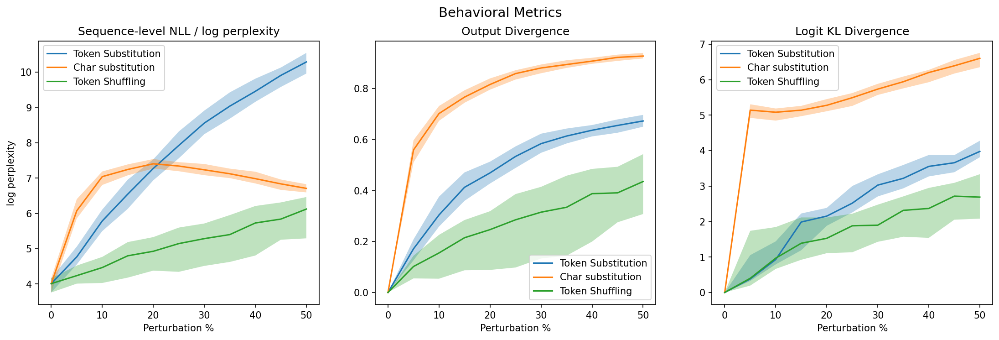
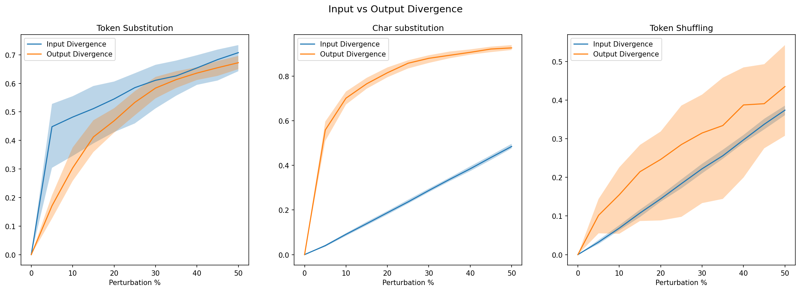
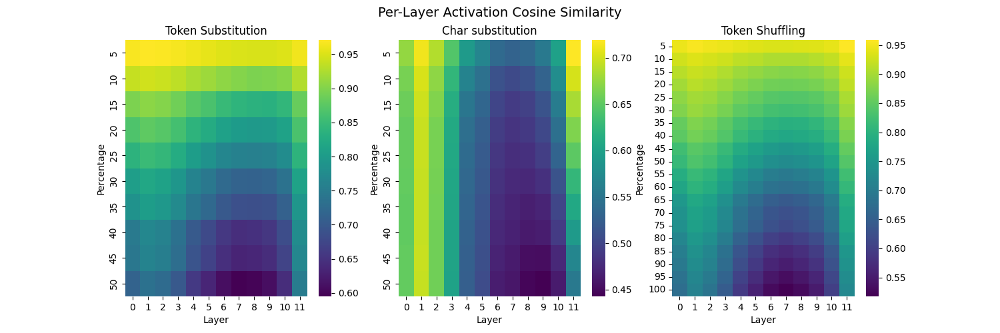
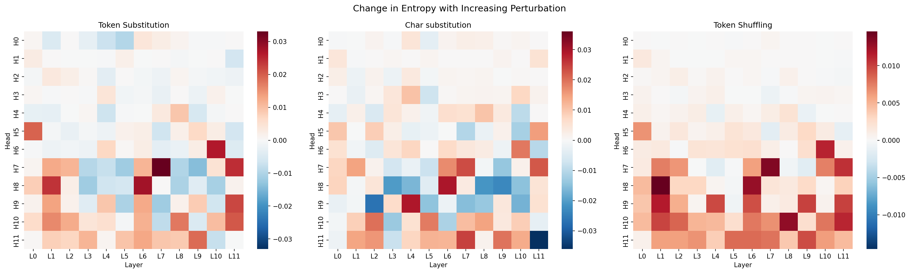
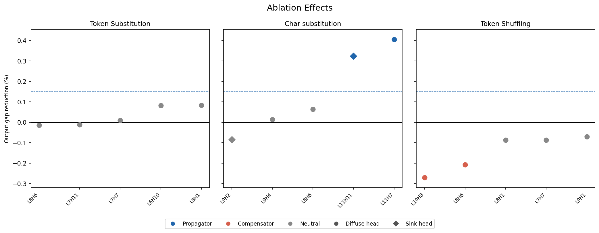

# Overview
Large language models (LLMs) are often evaluated on clean text. However, real-world inputs are rarely clean. User prompts may contain typos, OCR artifacts, formatting errors, incorrectly copy/pasted fragments, or shuffled and partially corrupted content. These perturbations can affect model outputs in ways that are difficult to predict from input alone.

Most robustness evaluations focus on the behavioral level: whether the model’s final answer changes, whether accuracy drops, or whether perplexity increases. These measurements are useful, but they do not explain where perturbations induce damage within the model’s computation or whether different perturbation types cause the model to fail in the same way. A typo, a corrupted token, and a shuffled sentence may all degrade model behavior, but they stress different parts of the tokenization and model computation.

In this project, I study how three simple perturbation types affect GPT-2 outputs: Token substitution, character substitution, and token shuffling. I compare their effects at three levels: Output behavior, layer-wise activation drift, and attention-head entropy. I then perform targeted single-head ablations on heads whose attention entropy change most strongly under perturbation.

I find that different types of perturbations induce different noise responses, as opposed to all perturbation types inducing a single generic noise response. Character substitution produces abrupt degradation, likely because small surface-form edits disrupt BPE tokenization before the transformer processes the sequence. Token substitution produces smoother degradation as corrupted lexical identities are integrated through the network. Token shuffling preserves lexical content but disrupts positional relations, producing a slower and more diffuse failure mode. Causal ablations provide tentative evidence that some perturbation-sensitive heads amplify degradation, while others appear to compensate for it.

Overall, these results suggest that robustness failures are perturbation-specific and mechanism-specific. Measuring output degradation alone can obscure important differences in how the model internally responds to corrupted inputs.

A summary of code and experiments can be found at my Github: https://github.com/emilyzfliu/decoding-robustness

# Experimental Setup
For all experiments, I used the GPT-2 small model (openai-community/gpt2) and the WikiText-2 Raw dataset as the source of input sequences. To control for sequence length, I filtered out samples shorter than 128 tokens and truncated all remaining sequences to exactly 128 tokens after tokenization.

For each clean input sequence x, I generated perturbed variants at perturbation strength $p \in [0,1]$ using three perturbation types:

**Token substitution**: Each token in the input sequence is independently replaced with a random token sampled uniformly from the tokenizer vocabulary with probability $p$.

**Character substitution**: Each character in the raw input text is independently replaced with a random alphanumeric or punctuation character with probability p. Because GPT-2 uses byte-pair encoding (BPE) tokenization, these character-level edits can substantially alter token boundaries and sequence length after tokenization.

**Token shuffling**: A contiguous window containing approximately $pN$ tokens (where $N$ is the sequence length) is selected uniformly at random, and the tokens within that window are randomly permuted while all tokens outside the window remain unchanged.
Because token identities are preserved, this perturbation disrupts primarily local positional and syntactic structure rather than lexical content itself.

# Behavioral Summary
*Q: How do perturbation types differ at the output/logit level?*

Before diving into model internals, I first measured how each perturbation type changes the model’s outputs. To evaluate output drift between perturbed and baseline inputs, I used three metrics:

**Negative Log Likelihood**: Sequence-level NLL measures how well the model predicts the next token under a perturbed input sequence. Lower NLL indicates that the model assigns higher probability to the observed continuation.
$$\mathrm{NLL}(x)=-\frac{1}{T}\sum_{t=1}^{T}\log p(x_t\mid x_{<t})$$
where $T$ is the sequence length.

**Output Divergence**: To compare generated outputs under clean and perturbed inputs, I compute normalized Levenshtein distance between generated sequences:
$$\mathrm{OutputDivergence}(y,\hat y)=\frac{\mathrm{EditDistance}(y,\hat y)}{\max(|y|,|\hat y|)}$$
where EditDistance is the Levenshtein edit distance. This measures how much the generated continuation changes under perturbation.

**Logit KL Divergence**: To measure how perturbations shift the model’s predictive distribution, I compute KL divergence between the clean and perturbed next-token distributions:
$$D_{KL}(P\parallel Q)=\sum_i P(i)\log\frac{P(i)}{Q(i)}$$
where P is the clean next-token distribution and Q is the perturbed distribution.

Overall, output-level results show that different types of perturbations produce distinct degradation profiles and internal signatures within the model, rather than a single shared robustness curve.

Figure 1. Perturbation types induce distinct degradation profiles.

## Token Substitution
Token substitution corrupts the lexical identity directly, producing smooth, dose-dependent degradation. Because the perturbation directly replaces token identities, but preserves sequence length and position, each additional corrupted token removes locally predictive lexical information. The smooth curve in all three plots suggests that GPT-2 does not hit an early threshold; degradation accumulates continuously with increasing perturbation percentages. Likewise, the monotonic increase of the curves and the absence of a threshold suggest that the model is not “correcting” for the substituted tokens. Instead, each substituted token contributes additively to the overall shift.
## Character Substitution
Character substitution changes the surface form of the input sentence, and often also the BPE segmentation that is used for tokenization. The sharpest change occurs from 0% to 5% perturbation, which corresponds to jumps in all three metrics. This likely reflects tokenization-mediated effects. Substituting characters within one word will change BPE segmentation, meaning additional edits no longer correspond to a smooth increase in token level corruption. NLL becomes less monotonic because the model is evaluating a token sequence whose boundary structure differs from the original. Likewise, the logit distribution also collapses, reflected in the sharp KL divergence spike, because the model encounters a statistically unlikely token sequence that breaks the statistical regularities of the token sequence distribution learned by the model. For the same reason, output divergence exhibits this same increase at low perturbation levels, although the effect is less dramatic. Once the perturbation is introduced, however, subsequent changes are gradual. After 5% perturbation, the model enters a degraded but stable processing regime once tokenization is sufficiently disrupted.
## Token Shuffling
Token shuffling was applied only within a contiguous local window rather than globally across the sequence, so substantial global contextual structure remained intact even at higher perturbation levels. As a result, token shuffling produces the weakest degradation across all three behavioral metrics. Sequence NLL increases gradually because the perturbation preserves the original token identities while disrupting only local positional and syntactic structure. Even when local order is corrupted, many tokens remain broadly compatible with the surrounding context, allowing the model to continue making locally plausible next-token predictions. Consequently, the degradation is substantially weaker than under token or character substitution, both of which directly corrupt lexical content. Likewise, logit KL divergence grows relatively slowly with perturbation strength, suggesting that GPT-2 retains substantial robustness to moderate local positional corruption when lexical information is preserved. However, the model does not fully recover the original ordering of the shuffled region. Output divergence still increases steadily with perturbation strength, indicating that preserving lexical content alone is insufficient to fully reconstruct the original contextual structure once local positional relationships are disrupted

Below is a comparison of text divergence for both input and output texts. As expected, token substitution exhibits increased divergence with increasingly corrupted input, but maintains a similar level of disparity after decoding. Character substitution likewise has a far higher output divergence than input divergence, as a result of the modified BPE encodings. Token shuffling appears on average to produce higher output divergence than the amount of input divergence originally introduced. The high variance band suggests that the model’s response to shuffling is example-dependent: for some sequences, lexical content may be sufficient to preserve a similar continuation, while for others, disrupted order causes much larger output drift.

Figure 2: Input vs output normalized Levenshtein Distance for differing perturbation types.

## Takeaways
Taken together, these results suggest that perturbation sensitivity in GPT-2 depends strongly on which level of the input pipeline is disrupted. Character perturbations act upstream of the transformer itself by altering tokenization structure, token substitutions directly corrupt lexical identity while preserving sequence structure, and shuffling primarily disrupts positional relations while preserving lexical content. These differences produce distinct degradation profiles in both output behavior and predictive distributions.

# Layer-wise Activation Drift
*Q: Where does perturbation sensitivity emerge inside the model?*

The output-level metrics suggest that different perturbation types produce qualitatively different degradation profiles. To understand where these effects emerge internally, I next measured how perturbations alter the model’s hidden representations across transformer layers.

For this analysis, I compute the cosine similarity between hidden activations for clean and perturbed inputs at each layer. Intuitively, activation similarity measures how closely the perturbed residual stream follows the clean computation trajectory as perturbation strength increases.

For token substitution and token shuffling, token positions remain aligned, so cosine similarity can be computed positionwise and averaged across tokens. Character perturbations are more difficult because BPE tokenization can change both sequence length and token boundaries. For character substitution, this positionwise comparison should therefore be interpreted cautiously: position t in the clean sequence may not correspond to the same textual unit as position t in the perturbed sequence. I include this analysis because it still captures how quickly the residual stream diverges under character-level corruption, but it should not be read as a perfectly token-aligned comparison.

Because token shuffling exhibited the slowest degradation in the output-level metrics, I evaluated shuffle perturbations up to 100% global shuffling, while token and character substitution were capped at 50% corruption.
For a clean sequence $x$ and perturbed sequence $x’$, let:
$h^{(\ell)}_t(x)$ denote the hidden activation at layer $\ell$ and token position $t$
$T$ denote the number of valid token positions
The layer-wise activation similarity is
$$\mathrm{ActSim}(\ell)=\frac{1}{T}\sum_{t=1}^{T}\frac{h_t^{(\ell)}(x)\cdot h_t^{(\ell)}(x')}{\|h_t^{(\ell)}(x)\|\,\|h_t^{(\ell)}(x')\|}$$

Figure 3: Layer-wise activation similarity across perturbation types.

## Token Substitution
For small perturbation percentages, only a small fraction of tokens are replaced. As a result, the perturbed residual stream remains relatively close to the clean trajectory. Activation similarity therefore stays high in early perturbation regimes. As perturbation strength increases, cosine similarity decreases across all layers, but the degradation is not uniform.

The most pronounced drop occurs in middle-to-late layers, particularly around layers 6 and 7. This is broadly consistent with prior observations that GPT-2’s intermediate layers increasingly integrate contextual and semantic information rather than only local lexical or syntactic structure. Early layers remain comparatively robust because many local structural features are still preserved, even when some token identities are corrupted. However, once corrupted token identities are integrated into broader contextual representations, the perturbed computation diverges more sharply from the clean trajectory.

In other words, token substitution does not immediately destroy the residual stream at early layers. Instead, the corruption compounds as later layers attempt to integrate semantically inconsistent token identities into the surrounding context. The steep activation drift in middle-to-late layers likely reflects the point at which local token corruption begins to substantially alter higher-level contextual representations.

## Character Substitution
Because character substitution can alter BPE segmentation and sequence length, per-token activation similarity is less reliable as a metric than for token substitution or shuffling. Even at low perturbation rates, early-layer activation similarity is already substantially lower (peaking around 0.7 cosine similarity, compared to ~0.95 for token substitution and shuffling). This suggests that small character edits rapidly move the model into a different tokenization regime before the transformer layers process the sequence.

Unlike token substitution, additional character noise produces relatively little further degradation in early layers, likely because the token sequence has already been significantly restructured. However, middle-to-late layers still exhibit progressively stronger representational drift. As contextual representations are built on top of already-corrupted token embeddings, the divergence compounds through later layers in a pattern similar to token substitution, but starting from a substantially more disrupted early-layer state.

## Token Shuffling
Token shuffling exhibits a similar overall trend: cosine similarity decreases as perturbation strength increases, with the largest representational drift appearing in middle-to-late layers at high perturbation levels. However, the degradation is substantially more gradual than for token substitution. At 50% perturbation, activation similarity remains around 0.80–0.85, compared to roughly 0.60–0.70 for token substitution at the same corruption level.

This relative robustness likely reflects the fact that shuffling preserves token identity while disrupting only order and positional relations. Unlike token substitution or character corruption, the underlying token embeddings remain unchanged, so early representations stay relatively close to the clean trajectory even when local order is corrupted. Divergence accumulates more gradually in later layers as the model increasingly relies on positional and contextual relationships to integrate information across the sequence.

The absence of a sharp collapse suggests that positional corruption does not immediately destroy the residual stream. Instead, contextual integration becomes progressively noisier as attention operates over increasingly unreliable positional structure. In this sense, token shuffling is unique among the perturbation types studied here: the lexical content entering the network is still correct, and the degradation emerges primarily from disrupted relational structure rather than corrupted token identity itself.

## Takeaways
Across all perturbation types, representational drift tends to amplify through the network rather than being eliminated in early layers. However, the point at which divergence enters the residual stream differs substantially across perturbation types.

Character perturbations introduce large activation drift immediately, likely because small surface-form edits alter BPE tokenization before the transformer layers process the sequence. In contrast, token substitution and token shuffling remain relatively close to the clean trajectory in early layers and diverge more strongly in middle-to-late layers as corrupted lexical or positional information becomes increasingly integrated into contextual representations.

Taken together, these results suggest that perturbations do not simply add uniform noise into the model. Instead, different perturbation types enter the network through different interfaces (tokenization structure for character substitution, lexical identity for token substitution, and positional relations for token shuffling) and produce distinct representational trajectories as the residual stream evolves through depth.

## Attention Head Entropy
*Q: Does perturbation make attention more diffuse or more focused?*

In addition to residual stream activations, I also wanted to understand how different perturbation types reshape attention behavior inside the model.

To study this, I measured the entropy of each attention head’s attention distribution under increasing perturbation strength. For each head, I compute the entropy of its attention distribution over source positions and average across query positions and examples. Attention entropy provides a coarse measure of how concentrated or diffuse a head’s attention pattern is across positions. Higher entropy indicates that, on average, attention is spread more broadly across the sequence, while lower entropy indicates more concentrated attention.

$$H^{(\ell,h)} = - \frac{1}{T}\sum_{t=1}^{T}\sum_{i=1}^{T} A^{(\ell,h)}_{t,i}\log A^{(\ell,h)}_{t,i}$$

Intuitively, increasing entropy suggests that a head is distributing attention more diffusely under corruption, whereas decreasing entropy suggests that attention is collapsing onto a smaller set of positions or stable “anchor” tokens. To measure this effect, I used a simple linear regression to compute the change in entropy for different heads:
$$\Delta H^{(\ell,h)} = \frac{dH^{(\ell,h)}}{d\alpha}$$
Where $\alpha$ measures perturbation strength.

Figure 4: Per-head attention entropy change under perturbation. Entropy change is estimated via linear regression across perturbation strengths. Red indicates increasing attention entropy (more diffuse attention patterns), while blue indicates decreasing entropy (more concentrated attention patterns).

## Token Substitution
Token substitution produces a heterogeneous mixture of entropy increases and decreases across heads, suggesting that different attention mechanisms respond differently to lexical corruption. Some heads become more diffuse under perturbation, while others become more concentrated.

One possible explanation is that token substitution creates competing effects on different types of contextual features. Heads that rely heavily on semantic or lexical consistency lose reliable targets once token identities are corrupted, causing attention to spread more broadly across the sequence. In contrast, heads associated with local structural patterns or stable token classes may become more concentrated because punctuation, positional structure, and common function words are partially preserved even under random substitution.

The coexistence of red and blue heads therefore suggests that token substitution does not induce a single global attention response. Instead, perturbations interact differently with different attention circuits depending on the type of information those heads appear to track.

## Character Substitution
Character substitution produces more negative entropy slopes overall, suggesting that attention becomes more concentrated rather than more diffuse. One possible explanation is that tokenization disruption weakens the reliability of ordinary content-token representations. When many content tokens are converted into unfamiliar subword fragments, some heads may increasingly concentrate on stable structural positions or tokens that survive the perturbation, producing sink-like behavior. The overlap between blue heads under token substitution and character substitution suggests that some heads may have a general tendency toward concentration under lexical corruption, although this interpretation would require more targeted analysis.

## Token Shuffling
Token shuffling preserves the token set but disrupts local ordering, making positional and syntax-sensitive attention patterns less reliable. As a result, many heads increase their attention entropy and distribute attention more broadly across the sequence.
This behavior is consistent with attention diffusion: because local order and contextual relationships are corrupted, heads that rely on stable positional structure can no longer confidently focus on specific target positions. Instead, attention becomes more distributed as the model attempts to integrate context from increasingly unreliable positional information. This does not necessarily mean the model is successfully reconstructing the original order; rather, the attention pattern becomes less concentrated as the model processes sequences whose local positional relationships are less reliable.

Compared to character substitution, the entropy shift under shuffling skews strongly toward diffusion rather than concentration. Because the underlying token identities are still preserved, the model retains meaningful lexical information and does not collapse as strongly into the sink-like or anchor-focused attention patterns observed under tokenizer disruption.

## Takeaways
Token substitution and token shuffling generally increase attention entropy in specific later heads and layers, consistent with more diffuse attention patterns under lexical or positional corruption. By contrast, character substitution more often decreases attention entropy, suggesting increasingly concentrated or sink-like attention patterns under tokenizer disruption. These entropy signatures mirror the broader representational patterns observed earlier: positional corruption produces gradual diffusion-like degradation, while tokenizer disruption induces more abrupt and concentrated failure modes.

# Causal head ablation
*Q: Which perturbation-sensitive heads causally affect output degradation under single-head ablation?*

To test whether the heads identified in the previous section were merely correlated with perturbation sensitivity or played a causal role in output degradation, I performed targeted single-head ablations. For each perturbation type, I selected the heads with the largest-magnitude entropy slope from the previous analysis. These are the heads whose attention entropy changed most strongly as perturbation percentage increased, making them natural candidates for mediating the model’s response to corrupted inputs.
For each selected head, I ablated the head individually and measured the resulting change in output divergence relative to the unablated perturbed model. I report this as output gap reduction percentage:

$$\mathrm{GapPercent}_a= \frac{\mathrm{OutputDivergence}_o - \mathrm{OutputDivergence}_a}{\mathrm{OutputDivergence}_o} \times 100$$

Where $\mathrm{OutputDivergence}_o$ is the original output divergence between ablated and perturbed input, and $\mathrm{OutputDivergence}_a$ is the output divergence under ablation of head $a$.

Figure 5: Causal ablation summary. Heads are selected by largest-magnitude entropy slope from the previous section. Positive values indicate that ablation reduces output divergence; negative values indicate that ablation increases output divergence. I use \pm 0.15% as a neutral band.

Positive values mean that ablating the head reduced output divergence: removing the head made the model’s output distribution closer to the clean baseline. I label these heads as propagators, since their activity appears to contribute to perturbation-induced output degradation. Negative values mean that ablating the head increased output divergence: removing the head made the model less robust. I label these heads as compensators, since they appear to help preserve output stability under perturbation. Values inside the  $\pm$ 0.15% band are treated as neutral.

The figure also distinguishes between two attention-pattern classes identified in the previous section: sink heads and diffuse heads, corresponding to entropy decrease and entropy increase respectively. Sink heads concentrate attention on a small set of positions, often behaving like attention anchors, while diffuse heads spread attention more broadly across the sequence. This distinction helps interpret whether perturbation-sensitive heads are acting through concentrated routing behavior or through broader aggregation.

## Token Substitution
For token substitution, the selected high entropy-slope heads have only small effects. Most heads are neutral, with gap reduction values close to zero. A few heads show weak positive effects, meaning that ablating them slightly reduces output divergence, but none cross the propagator threshold. This suggests that under token substitution, high entropy-slope heads are not individually strong causal drivers of output degradation. Instead, the perturbation effect may be distributed across many components. Token substitution changes lexical content while preserving much of the surrounding structure, so the model’s degradation may arise from many local semantic disruptions rather than a small number of identifiable attention heads.
## Character Substitution
For character substitution, the effects are much stronger. Two heads, L11H11 and L11H7, produce large positive gap reductions when ablated, indicating that they act as propagators of degradation. Removing these heads makes the output distribution substantially closer to the clean baseline. This suggests that, for character-level noise, some high entropy-slope heads are not merely responding to perturbation severity but actively contribute to transmitting corrupted representations downstream.

The sink/diffuse distinction is informative here. L11H11 is marked as a diffuse head and shows a large positive ablation effect. This suggests that broad attention under character corruption may be harmful: rather than helping the model recover, the diffuse head may aggregate noisy or fragmented evidence across the sequence and propagate that corruption into later computation. L9H2, in contrast, is marked as a sink head and has a small negative effect: ablating it slightly worsens output divergence, though not enough to cross the compensator threshold. This is consistent with the possibility that some sink-like behavior is mildly stabilizing under character corruption, perhaps by anchoring attention when token-level evidence becomes unreliable.
## Token Shuffling
For token shuffling, the pattern reverses. The selected high entropy-slope heads mostly have negative gap reduction values, meaning that ablating them increases output divergence. Two heads cross the compensator threshold. In this setting, the original lexical items remain present but their order is disrupted. The high entropy-slope heads may therefore be helping the model recover useful semantic information despite syntactic disorder. Removing them makes the model less able to compensate for the shuffled input, so output divergence increases.

This contrast suggests that the role of perturbation-sensitive heads depends strongly on the type of corruption. Under character substitution, high entropy-slope heads can amplify degraded lexical representations. Under token shuffling, high entropy-slope heads can instead support robustness by helping the model integrate information from a disrupted sequence. Token substitution sits between these regimes, with no strong single-head causal effects.

## Takeaways
Overall, this analysis supports a more nuanced interpretation of entropy slope. Large changes in attention entropy identify heads whose computation is sensitive to perturbation, but they do not by themselves indicate whether a head is harmful or helpful. Ablation is needed to distinguish propagators, which amplify perturbation-induced degradation, from compensators, which mitigate it. The sink/diffuse labels add another layer: diffuse behavior may be harmful when the input content itself is corrupted, as in character substitution, while more anchoring behavior may be neutral or mildly stabilizing. However, this interpretation remains tentative because only a small number of heads were tested, and the sink/diffuse categories are qualitative summaries of attention structure rather than complete mechanistic explanations.

Perturbation-sensitive heads are not uniformly “bad.” Some appear to propagate failures, some compensate for them, and many have little individual causal effect. This suggests that robustness failures are perturbation-specific and mechanism-specific: the same entropy-based discovery method can surface very different functional roles depending on whether the model is dealing with corrupted tokens, corrupted characters, or disrupted order.
# Conclusions
The main takeaway from this project is that “input perturbation” is not a single failure mode. Different perturbations enter the model through different computational interfaces— tokenization structure, lexical identity, and positional relations— and produce qualitatively different internal behaviors as they propagate through the network.

Character-level perturbations behaved distinctly from the other corruption types. Rather than producing gradual degradation, character substitutions caused abrupt representational divergence early in the network, likely because tokenizer disruption fundamentally changes the structure of the model’s input representations. In contrast, token substitution and local token shuffling produced much smoother degradation profiles, with errors accumulating more gradually through later layers.

One thing I found interesting was that attention entropy alone was not enough to explain causal importance. Some heads showed strong entropy shifts under perturbation while having little causal effect, while a smaller subset of late-layer heads appeared disproportionately important for propagating corrupted representations. This suggests that descriptive attention statistics and causal importance are related but distinct properties of the network.

More broadly, these results point toward a more mechanism-specific view of robustness. Robustness depends not only on how much corruption is present, but on what part of the computation the corruption targets. Perturbations that damage tokenization, lexical identity, or positional structure do not simply scale the same failure mode up or down; rather, they appear to induce different computational regimes inside the model.

There are still many open questions here. The experiments in this project were limited to GPT-2 small and relatively synthetic perturbations, and the causal analysis only explored a small number of candidate heads. It would be interesting to see whether similar perturbation-specific signatures appear in larger instruction-tuned models, under more realistic datasets and perturbation distributions, or under stronger intervention-based analyses.
